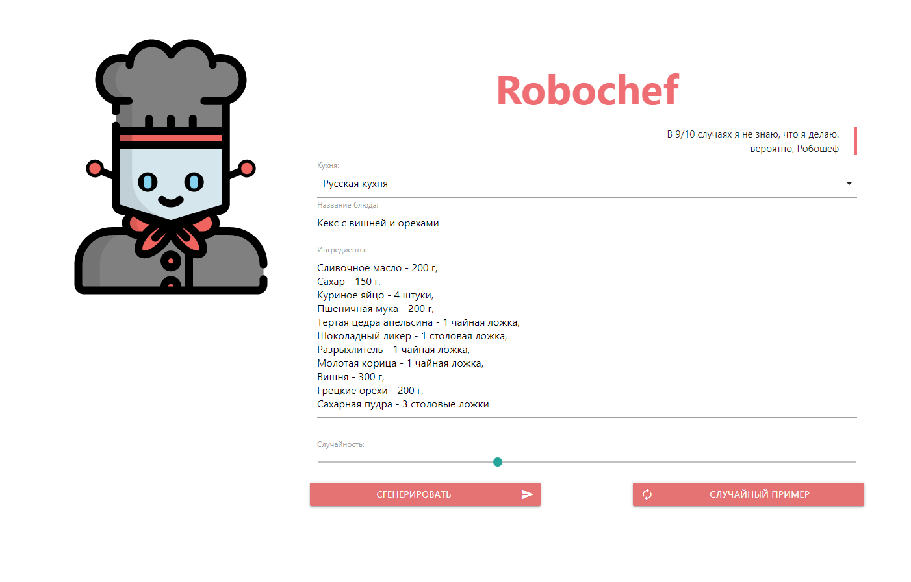
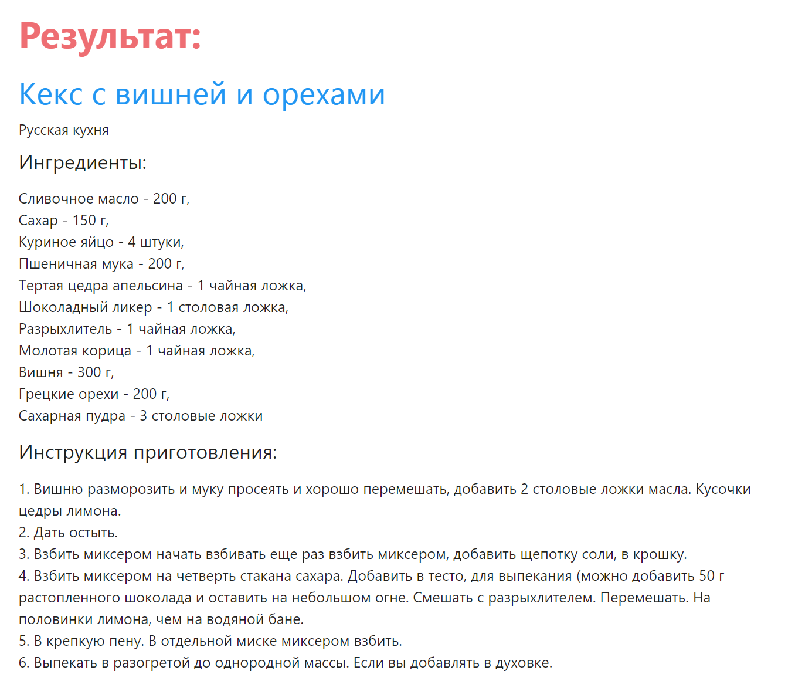

# Robochef/Робошеф

LINK: [ROBOCHEF](http://robochef.flongy.ru)

Your own special artificially intelligent chef - not a day without a masterpiece meal.  
Ваш личный шеф-повар с искусственным интеллектом - ни дня без шедеврального блюда.  

## Screenshot

  
  

## Contents

1. [Russian](#russian)
    1. [Описание](#описание)
    2. [Зависимости](#зависимости)
    3. [Архитектура](#архитектура)
    4. [Использование](#использование)
    5. [Будущее](#будущее)
2. [English](#english) (left blank for future me)

# [Russian](#russian)

Это русское описание. English description will be made in the future (maybe...)

1. [Описание](#описание)
2. [Зависимости](#зависимости)
3. [Архитектура](#архитектура)
4. [Использование](#использование)
5. [Будущее](#будущее)

## [Описание](#описание)

Интерфейс для взаимодействия с нейросетью, генерирующей рецепты, представленный в виде веб-сервера.  

Робошеф может подсказать вам новые рецепты, новые сочетания ингредиентов, названия возможных произведений, 
а также попробовать приготовить некоторое блюдо согласно иностранной кухне.  

Если вас не устраивает его ответ, можете повторно сгенерировать на том же вводе - он придумает новый случайный рецепт.

## [Зависимости](#зависимости)

Сервер написан на `Python 3.9` с помощью модуля `http.server`, представленного в стандартной библиотеке.

Сторонние библиотеки:  
- [PyTorch](https://pytorch.org/) - библиотека для задач машинного обучения;
- [Sentencepiece](https://github.com/google/sentencepiece) - библиотека для деления предложения на токены;
- [Materialize](https://materializecss.com/) - фреймворк для создания сайтов в material дизайне;
- [jQuery](https://jquery.com/) - JavaScript библиотека для упрощения написания динамических веб-сайтов.

## [Архитектура](#архитектура)

Архитектуру и код для генерации текста заимствовал из репозитория [PyTorch Examples](https://github.com/pytorch/examples) 
(отсюда и упоминание их в лицензии). 

Сама нейросеть состоит из:
1. Слоя Embedding,
2. Позиционного кодирования (которое необходимо для работы трансформеров),
3. Transformer кодировщика,
4. Обычного полносвязного декодировщика.

Однако, в отличие от модели в примерах к `PyTorch`, я сделал, чтобы она принимала данные в форме 
`[batch size, sequence length]` - то есть, чтобы первым измерением был `batch`. 

## [Использование](#использование)

**Важное предупреждение:** чтобы не навлекать на себя лишних проблем, ни чекпоинт нейросети, 
ни `Sentencepiece` модель со словарем я не буду публиковать. То же касается датасета и кода для его подготовки.
Также не будет кода цикла обучения нейросети, но он несложный, и нечто похожее можно найти в 
[PyTorch Examples](https://github.com/pytorch/examples), если так хочется его посмотреть.  

Поэтому перед тем, как запусить Робошефа, необходимо поместить готовую `SentencePiece` модель по пути `./model/sp_model.model`
и веса самой нейросети по пути `./model/best_model.pt` (сохраненную через `torch.save()`).
  
Для запуска сервера, вам необходимо установить две `Python` библиотеки: [PyTorch](https://pytorch.org/) и 
[Sentencepiece](https://github.com/google/sentencepiece), которые могут быть скачаны через `pip`. Для работы Робошефа
нет необходимости в видеокарте или `CUDA` версии `PyTorch` - он спокойно работает на обычном CPU (естественно, 
поддерживающем данную библиотеку).  
  
Далее достаточно запустить файл `website.py`:  
```
python3 website.py
```
Теперь достаточно открыть в браузере адрес `127.0.0.1` (или какой-либо иной IP компьютера, на котором запускается 
программа).

При загрузке страницы, некоторые поля будут заполнены случайными значениями из списка примеров рецептов, чтобы помочь тем, 
кому не хватает фантазии придумывать свои названия и ингредиенты. Примеров немного, но если текущий вам не очень интересен,
то можно нажать `СЛУЧАЙНЫЙ ПРИМЕР`, чтобы заполнить новым случайным рецептом.
  
Для начала генерирования рецепта достаточно выбора кухни и случайности: остальные поля можно оставить пустыми. Таким образом,
Робошеф придумает название блюда и список ингредиентов за вас!

Также при введении только названия возможна генерация списка ингредиентов, если это поле будет оставлено пустым или 
заполненным наполовину. Кстати, Робошеф любит добавлять свои ингредиенты к уже предоставленному списку...

И, естественно, нажать кнопку `СГЕНЕРИРОВАТЬ`, чтобы отправить серверу эти значения, который уже активирует нейросеть.

Иногда могут возникать ошибки при генерации текста. Обычно это означает, что нейросеть пропустила какой-то заголовок, 
например, `ИНГРЕДИЕНТЫ` или `ИНСТРУКЦИЯ ПРИГОТОВЛЕНИЯ` и сплошной текст решила генерировать. Тогда просто будет сообщение 
об ошибке генерации (конечно, просто брать и выкидывать свою работу плохо, но я как-нибудь потом пересмотрю решение 
для такой ситуации, и, например, просто этот сплошной текст без форматирования буду выводить).

## [Будущее](#будущее)

Естественно, на данный момент (даже по примеру в скриншоте представленном в этом README) видно, что Робошеф пока не очень 
справляется с русским языком: путается в словах, выдумывая несуществующие, много повторяется, 
часто забывает о пунктуации, теряет сказуемые или подлежащие и выдает какой-то несвязный текст.

Помимо этого Робошеф редко обращается к названию и списку ингредиентов, подбирая просто случайные продукты в своих рецептах.

Это наиболее заметные для меня проблемы Робошефа, и у меня есть несколько идей, которые можно попробовать для 
усовершенствования генерируемых рецептов:

- Подкрутить параметры модели  
Самое простое, но банальное и скорее всего с наименьшим эффектом, предложение. Просто подкрутить количество нейронов в
скрытых слоях, количество самих слоёв или длину последовательностей, на которых тренируется нейросеть (однако, не все 
рецепты могут быть достаточно длинными для увеличения последнего параметра, поэтому и эффект может не быть таким явным). 

- Попробовать новую архитектуру  
Да, трансформеры за последнее время набрали очень много внимания к себе, так как эта новая архитектура так хорошо 
справляется с задачами NLP (и [не только](https://arxiv.org/abs/2010.11929)). И я полностью с этим согласен, но у 
трансформеров есть два различных модуля в их архитектуре: кодировщики (encoder layer) и декодировщики (decoder layer), 
что даёт три варианта в их сочетании: Encoder-Decoder, только Encoder (как раз архитектура Робошефа), только Decoder. 
Можно попробовать все три архитектуры для задачи генерации рецептов, что может улучшить качество текстов.

- Использовать больший датасет  
Для обучения модели Робошефа, представленного на [сайте](http://robochef.flongy.ru), я использовал всего 5.5 тысяч рецептов 
(около 4.6 миллионов символов), что может показаться достаточно немалым количеством, но если посмотреть на объемы текста, 
используемых в обучении [GPT-3](https://arxiv.org/abs/2005.14165) - более 240 миллионов документов (более **триллиона** символов! 
Что примерно в 200 000 больше чем в моих поделках). И да, конечно, GPT модели обучаются на англоязычных текстах преимущественно,
к тому же и не на рецептах для готовки, а на различные темы, но из этого замечания выходит четвёртая идея:

- Использовать предтренированную модель  
Даже название модели GPT, которую я упоминал выше, расшифровывается как `Generative Pre-trained Transformer`. И да, 
последнее время стал популярным, так называемый, `Fine-Tuning`, когда вы берёте такую огромную махину, как GPT, и натягиваете
на собственную задачу. Я уверен, то же можно сделать и с Робошефом: обучить на большом объеме русского текста (на Википедии
или даже на произведениях отечественной литературы, а можно и обоих 😉), а затем дотренировать на генерации рецептов.
 